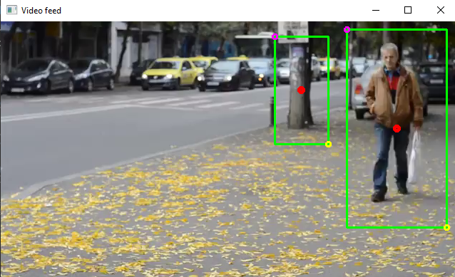

# Proyecto: Detección y reidentificación de personas en secuencias de imágenes o video
## Curso: Estructura de datos

### Integrantes

* Brayan Alexis Maldonado Carrasco 
* Martín Enrique A. Díaz Tapia

### Bitácora

[Ver Bitácora](docs/BITACORA.md)

### Resumen

En este taller se realizara un software de identificacion de personas el cual funcionara a base a inteligencia artificial previamente entrenada , el cual reconocera personas en secuencias de imagenes o videos mediante una camara o un video ya previamente grabado.El programa en el transcurso de su ejecucion se podra ver como identifica a las personas presentes en el video y las clasifica segun diversos parametros(como por ejemplo posicion), ademas de resaltar un rectangulo de color rojo sobre cada una de estas personas , al terminar la ejecucion del programa se podra saber cuantas personas diferentes entre si han pasado por en frente de la camara , cuantas han entrado y salido del resinto entre otros.

### Documentos

* [Reporte Técnico](docs/README.md)

